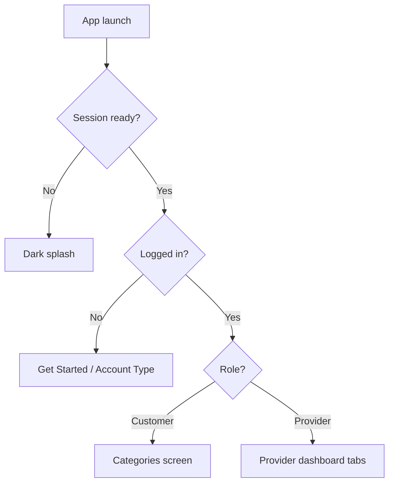
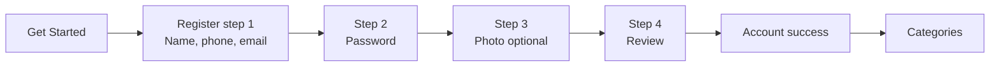
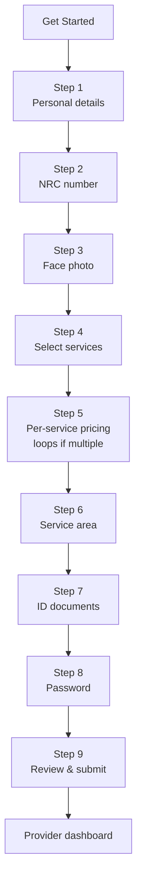
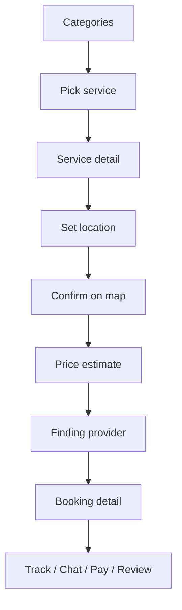
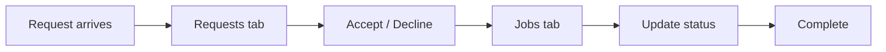

# ServiceHub — Designer Handoff

**Version:** 1.0 (August 2026)  
**Platform:** Mobile-first React Native app (Expo) — iOS, Android, and web preview  
**Audience:** UI/UX designers, brand designers, and anyone extending the visual system  

> This document describes how the app is structured and how it works. It is **not** part of the app UI and is not shown to end users. Share this file (or export to PDF) with your design team.

---

## 1. Product overview

**ServiceHub** is a local services marketplace for **Zambia**, focused on three categories:

| Category | Examples |
|----------|----------|
| **Beauty & Cosmetics** | Salon, barbershop, grooming |
| **Cleaning & Outdoor** | Home/office cleaning, gardening |
| **Repair & Maintenance** | Phones, appliances, plumbing, electrical |

**Two roles use the same app:**

| Role | Who they are | Primary goal |
|------|----------------|--------------|
| **Customer** | People who need a service | Find, book, track, pay, and review providers |
| **Service Provider** | Skilled workers / businesses | Receive requests, manage jobs, set availability, earn |

**Visual identity (current build):**

- Full-screen **photographic background** (`welcome-bg.png`)
- Dark gradient overlay so text stays readable
- **Frosted glass** panels (real transparency — not solid white cards)
- **Champagne gold** accents for customer actions
- **Blue** accents for provider actions
- Rounded pill buttons, soft borders, light status bar on dark backgrounds

**Reference image (design target):**  
`assets/images/brand/get-started-ref.jpg`

**Live background in app:**  
`assets/images/brand/welcome-bg.png`

---

## 2. How the app starts (routing logic)

When the app opens, a splash gate checks login state and sends the user to the right area:



| Condition | Destination |
|-----------|-------------|
| Not logged in | **Get Started** — choose Customer or Provider account |
| Customer logged in | **Categories** (post-login landing) |
| Provider logged in | **Provider Home** tab (or **Setup** if profile incomplete) |

---

## 3. Information architecture (full map)

### 3.1 Top-level structure

```
ServiceHub
├── Auth & onboarding          (logged out)
├── Customer experience      (role = customer)
└── Provider experience      (role = provider)
```

### 3.2 Auth & onboarding screens

| Screen | Route | Purpose |
|--------|-------|---------|
| Get Started | `/(auth)/account-type` | Landing: Customer vs Provider cards, Google sign-in, Sign In link |
| Customer sign up | `/(auth)/register?step=1–4` | 4-step registration wizard |
| Provider sign up | `/(auth)/register-provider` | 9-step provider application |
| Sign in | `/(auth)/login` | Email/phone + password, Google, forgot password |
| Verify email | `/(auth)/verify` | 6-digit code (demo shows code on device) |
| Account success | `/(auth)/account-success` | Customer welcome after registration |
| Forgot password | `/(auth)/forgot-password` | Request reset |
| Reset password | `/(auth)/reset-password` | New password with code |
| Provider pending | `/(auth)/provider-pending` | Application under review (optional status) |
| Provider submitted | `/(auth)/provider-submitted` | Submission confirmation (optional) |

### 3.3 Customer screens

**Main tabs (always visible bottom bar):**

| Tab | Label in UI | Purpose |
|-----|-------------|---------|
| Home | Home | Dashboard: location, search, categories, services, providers, active bookings |
| Bookings | Bookings | All booking history |
| Center FAB | — | Opens **Search** (not a tab) |
| Alerts | Alerts | Notifications |
| Profile | Profile | Account menu, settings, sign out |

**Stack screens (opened from Home, tabs, or deep links):**

| Screen | Purpose |
|--------|---------|
| Categories | Pick Beauty / Cleaning / Repair after login |
| Search | Search services and providers |
| Category detail | Services in one category |
| Service detail | One service + providers who offer it |
| Providers list | Compare providers for a service |
| Provider profile | Bio, rating, services, book button |
| Book | Book a specific provider + service |
| Location | Saved customer location |
| Settings | Edit name and phone |
| Help | Support copy |
| Booking detail | Status timeline, price, actions |
| Tracking | Provider en route (map hero) |
| Chat | Messages for a booking |
| Payment | Pay after completion |
| Review | Star rating + comment |

**Service request flow (step-by-step booking):**

| Step | Screen | Purpose |
|------|--------|---------|
| 1 | Categories | Choose category |
| 2 | Request — Services | Pick a service |
| 3 | Request — Detail | Service info |
| 4 | Request — Location | GPS, map pin, or address |
| 5 | Request — Confirm | Map preview + confirm |
| 6 | Request — Estimate | Price breakdown + submit |
| 7 | Request — Finding | “Finding a provider…” loading |

### 3.4 Provider screens

**Main tabs:**

| Tab | Label | Purpose |
|-----|-------|---------|
| Home | Home | Dashboard: online toggle, earnings, active jobs |
| Requests | Requests | New booking requests to accept/decline |
| Center FAB | — | Opens **Notifications** tab |
| Jobs | Jobs | Active / completed / cancelled jobs |
| Profile | Profile | Services, availability, reviews, settings |

**Stack screens:**

| Screen | Purpose |
|--------|---------|
| Setup | First-time profile: bio, area, services, prices |
| Availability | Weekly schedule |
| Reviews | Customer reviews list |
| Request detail | Accept or decline incoming request |
| Job detail | Update job status, map, contact customer |
| Chat | Provider-side booking chat |
| Settings / Help | Same as customer (shared screens) |

---

## 4. User flows (for wireframes & prototypes)

### 4.1 Get Started → Customer account



| Step | Title | Fields |
|------|-------|--------|
| 1 | Create Your Account | First name, last name, phone (+260), email |
| 2 | Secure Your Account | Password, confirm, strength meter |
| 3 | Add a Profile Photo | Camera / gallery (optional, can skip) |
| 4 | Almost There! | Summary → Create Account |

**Navigation:** Back button goes through real history (step 4 → 3 → 2 → 1 → Get Started). Form data is kept when going back.

### 4.2 Get Started → Provider account



| Step | Title | Content |
|------|-------|---------|
| 1 | Personal Details | Full legal name, phone, email, date of birth, gender |
| 2 | Verify Your Identity | NRC number only (private) |
| 3 | Add Your Photo | Face photo for customers |
| 4 | What Services Do You Provide? | Multi-select from catalog |
| 5 | Service Details | Description, experience, price range, days/hours (repeat per service) |
| 6 | Where Do You Provide Your Services? | Location + travel radius |
| 7 | Verify Your Information | NRC upload (required); other docs optional |
| 8 | Account Security | Password + confirm |
| 9 | Review Your Provider Profile | Editable summary → Submit |

**Note:** Step 1 collects name, DOB, and gender once. Step 2 does **not** repeat those fields.

### 4.3 Sign in

```
Get Started → Sign In → (Customer) Categories
                      → (Provider) Provider Home [→ Setup if incomplete]
```

Also available: **Continue with Google** on Get Started and Sign In.

### 4.4 Customer books a service (main flow)



**Alternative path:** Browse Home → Provider profile → Book → Booking detail.

### 4.5 Provider handles a job



Typical booking statuses (for badges and timeline): requested → accepted → en route → in progress → completed (and cancelled).

---

## 5. Layout patterns (shells)

Designers should know there are **two screen wrappers** — same look, different use:

| Pattern | Used on | Contains |
|---------|---------|----------|
| **RegShell** | Auth & registration wizards | Back + step counter, progress bar, title, subtitle, glass form card |
| **AppShell / Screen** | Logged-in customer & provider screens | Photo background + gradient, scrollable content, optional header |

### Registration shell anatomy

```
┌─────────────────────────────────────┐
│  ← Back              Step 2 of 9    │
│  ████████░░░░░░░░  progress bar     │
│                                     │
│  Screen title (large, white)        │
│  Subtitle (muted white)             │
│  ┌─────────────────────────────┐   │
│  │  Glass panel                │   │
│  │  Form fields / buttons      │   │
│  └─────────────────────────────┘   │
└─────────────────────────────────────┘
     ↑ welcome-bg.png + gradient
```

### In-app shell anatomy

```
┌─────────────────────────────────────┐
│  ← Back    Screen title             │
│                                     │
│  Content (cards, lists, maps)       │
│                                     │
│                                     │
├─────────────────────────────────────┤
│  Tab bar + center FAB               │
└─────────────────────────────────────┘
```

### Get Started (account type) layout

```
┌─────────────────────────────────────┐
│  📍 ServiceHub                      │
│                                     │
│       Get Started                   │
│       Your Way    (script font)     │
│   Choose the account that fits…     │
│                                     │
│  ┌──────────┐  ┌──────────┐        │
│  │ Customer │  │ Provider │        │
│  │  glass   │  │  glass   │        │
│  │ gold CTA │  │ blue CTA │        │
│  └──────────┘  └──────────┘        │
│              or                     │
│     [ Continue with Google ]        │
│     Already have an account? Sign In│
└─────────────────────────────────────┘
```

On narrow screens, Customer and Provider cards **stack vertically**. From ~360px width up, they sit **side by side**.

---

## 6. Design system

### 6.1 Color palette

#### Brand & UI (primary tokens)

| Name | Hex / value | Usage |
|------|-------------|--------|
| Champagne gold | `#D4A373` | Customer CTAs, accents, active tab |
| Gold deep | `#C4894A` | Gradient end, darker gold |
| Gold soft | `#E8C4A0` | Highlights |
| Provider blue | `#3B7FD4` | Provider CTAs |
| Provider blue deep | `#1E5AA8` | Blue gradient end |
| Root background | `#0A1020` | Fallback behind photos |
| White | `#FFFFFF` | Primary text on dark |
| White soft | `rgba(255,255,255,0.90)` | Body text |
| White muted | `rgba(255,255,255,0.70)` | Secondary text |
| Text light | `rgba(255,255,255,0.48)` | Hints, inactive tabs |
| Error | `#FF8A7A` | Validation errors |
| Success | `#7DDBB0` | Success messages |
| On accent | `#2C2420` | Text on gold buttons (rare) |

#### Glass surfaces

| Token | Value | Usage |
|-------|-------|--------|
| Glass fill | `rgba(255,255,255,0.14)` | Default card |
| Glass fill light | `rgba(255,255,255,0.10)` | Subtle panels |
| Glass fill strong | `rgba(255,255,255,0.20)` | Emphasized panels |
| Glass border | `rgba(255,255,255,0.45)` | Card edges |
| Tab bar | `rgba(10,16,32,0.88)` | Bottom navigation |

#### Photo overlay gradient (top → bottom)

| Stop | Color |
|------|-------|
| Top | `rgba(8,12,28,0.18)` |
| Mid | `rgba(10,14,30,0.38)` |
| Bottom | `rgba(6,8,20,0.68)` |

#### Category accents

| Category | Background tint | Accent |
|----------|-----------------|--------|
| Beauty | `rgba(217,123,120,0.22)` | `#F0A8A5` |
| Cleaning | `rgba(106,163,106,0.22)` | `#9CD49C` |
| Repair | `rgba(91,143,184,0.22)` | `#8EC0E8` |

### 6.2 Typography

| Style | Size | Weight | Notes |
|-------|------|--------|-------|
| Hero | 34px | 800 | Get Started main title |
| Screen title | 26–28px | 800 | Registration / headers |
| Section title | 22px | 800 | Card titles |
| Body | 15px | 400–600 | Default copy |
| Small / label | 13px | 600 | Field labels |
| Caption | 11px | 600 | Tab labels, metadata |

**Script font** (decorative only): “Your Way” on Get Started — Snell Roundhand (iOS) / cursive (Android/web).

**Body font:** System default (San Francisco on iOS, Roboto on Android).

### 6.3 Spacing scale

| Token | px |
|-------|-----|
| xs | 4 |
| sm | 8 |
| md | 12 |
| lg | 16 |
| xl | 24 |
| xxl | 32 |

**Screen horizontal padding:** 16px (`lg`) on most screens.

### 6.4 Corner radius

| Token | px | Usage |
|-------|-----|--------|
| sm | 10 | Small chips |
| md | 14 | Inputs, inner rows |
| lg | 22 | Cards, tab bar top |
| xl | 28 | Large glass panels |
| pill | 999 | Buttons, search bar |

### 6.5 Shadows

| Level | Usage |
|-------|--------|
| Card | Lists, category tiles — soft drop shadow |
| Floating | Tab bar, center FAB — stronger elevation |

### 6.6 Glass effect rules (important for designers)

1. **Never use solid white cards** on top of the photo — use ~14–20% white tint + blur.
2. **Background must show through** — that’s the brand look.
3. **Thin white border** (~45% opacity) on glass panels.
4. **Inner highlight** on top-left edge of glass (subtle 28% white line).
5. **Inputs** inside glass: darker translucent fill, not opaque white.
6. **Focus state:** soft gray glow (not bright blue system default).

### 6.7 Buttons

| Type | Look | When |
|------|------|------|
| Primary gold | Gold gradient pill, white text | Customer main actions |
| Primary blue | Blue gradient pill, white text | Provider main actions |
| Secondary | Glass outline pill, white text | Take photo, secondary actions |
| Google | Full-width glass pill + Google icon | OAuth |
| Destructive text | Red/coral | Log out |

**Center FAB (tab bar):** 54×54 gold gradient circle with `+` (customer) or bell (provider), floats ~20px above tab bar.

---

## 7. Component library (what to reuse in Figma)

| Component | Description |
|-----------|-------------|
| **GlassPanel** | Frosted card — the main container for forms and menus |
| **RegField** | Label + glass input + error text (registration) |
| **InputField** | Label + glass input with optional icon (in-app) |
| **PrimaryButton** | Gradient pill CTA |
| **SecondaryButton** | Outlined glass button |
| **RegShell** | Full registration page frame |
| **AppShell** | Full in-app page frame |
| **ScreenHeader** | Back + title + subtitle |
| **AppTabBar** | 4 tabs + center FAB |
| **CategoryCard** | Category row/tile with tinted icon |
| **ServiceCard** | Service list row |
| **ProviderCard** | Provider with rating, distance, avatar |
| **BookingCard** | Booking summary + status badge |
| **StatusBadge** | Colored status pill |
| **StatusTimeline** | Vertical booking progress |
| **ProfileMenuRow** | Icon + label + chevron (profile menus) |
| **Avatar** | Circle with initials or photo |
| **SearchBar** | Glass search field |
| **PasswordStrength** | Checklist under password field |
| **ProfilePhotoPicker** | Circle preview + Take Photo / Gallery |
| **EmptyState / LoadingState / ErrorState** | Standard async UI |

---

## 8. Tab bars (exact structure)

### Customer

```
[ Home ] [ Bookings ]  ( + )  [ Alerts ] [ Profile ]
                         ↑
                    opens Search
```

### Provider

```
[ Home ] [ Requests ]  ( 🔔 )  [ Jobs ] [ Profile ]
                          ↑
                    opens Notifications
```

Active tab: gold icon + gold label. Inactive: muted white (~48% opacity).

---

## 9. Assets checklist for designers

| Asset | Path | Status |
|-------|------|--------|
| Main background photo | `assets/images/brand/welcome-bg.png` | **In use** (all shells) |
| Get Started reference | `assets/images/brand/get-started-ref.jpg` | Reference only |
| Tracking hero | `assets/images/brand/tracking-hero.jpg` | Tracking screen |
| Login hero | `assets/images/brand/login-hero.jpg` | Defined, not yet used in UI |
| Home hero | `assets/images/brand/home-hero.jpg` | Defined, not yet used in UI |
| App icon | `assets/images/icon.png` | Store / launcher |

**Brand mark in UI:** Gold gradient location pin + “Service**Hub**” wordmark (Hub in gold/script).

**Icons:** Ionicons outline style throughout (not custom icon set yet).

---

## 10. States & edge cases to design

| State | Where it appears |
|-------|------------------|
| Empty bookings | Bookings tab, Home |
| Empty notifications | Alerts tab |
| Loading | Lists, maps, “Finding provider…” |
| Error / retry | API or network failures |
| Validation errors | Red text under fields |
| Provider offline | Dashboard toggle |
| Provider setup incomplete | Redirect to setup wizard |
| Booking status variants | Timeline + badges |
| Map fallback | When no API key — placeholder card with address text |
| Permission denied | Location, camera, photos |
| Log out confirm | Profile → destructive action |

---

## 11. Content & data notes (for realistic mockups)

- **Phone format:** Zambian numbers, e.g. `+260 97 XXX XXXX`
- **Currency:** Zambian Kwacha — shown as `K` prefix (e.g. `K150`)
- **NRC format:** `123456/78/1`
- **Date of birth:** `YYYY-MM-DD` or `YYYY/MM/DD`
- **Demo accounts** (for testing prototypes against a dev build):
  - Customer: `customer@servicehub.zm` / `password123`
  - Provider: `provider@servicehub.zm` / `password123`

**Backend:** The app can talk to a live API, but many flows still work with **local/demo data** on device. Designers should not assume every screen is always full — empty states matter.

---

## 12. What is out of scope in the current UI

Useful for designers so they don’t design screens that don’t exist yet:

- Admin / operations dashboard
- In-app payment provider branding (Stripe, etc.) — placeholder flow only
- Real-time GPS routing on map (straight-line preview only)
- Push notification OS banners (in-app list only)
- Provider earnings payout / bank details
- Multi-language (English only today)

---

## 13. Suggested Figma file structure

Mirror the app architecture so handoff stays clear:

```
📁 ServiceHub Design
├── 🎨 Design tokens (colors, type, spacing, radii)
├── 🧩 Components (glass panel, buttons, inputs, cards, tab bar)
├── 📱 Auth & onboarding
│   ├── Get Started
│   ├── Customer registration (steps 1–4)
│   ├── Provider registration (steps 1–9)
│   └── Sign in / password reset
├── 📱 Customer
│   ├── Tabs (Home, Bookings, Alerts, Profile)
│   ├── Service request flow
│   ├── Booking detail / track / chat / pay / review
│   └── Settings & help
└── 📱 Provider
    ├── Tabs (Home, Requests, Jobs, Profile)
    ├── Setup & availability
    └── Job & request detail
```

---

## 14. Running the app (for design reviews)

Designers with access to the repo can preview the live UI:

```bash
cd ServiceHub
npm start
```

Then open **Expo Go** on a phone (scan QR) or press **w** for web at `http://localhost:8081`.

Web preview is useful for layout; native is best for true glass blur and gestures.

---

## 15. Contact & updates

When the product team changes flows or tokens, update this document and bump the version at the top. Source of truth for tokens in code:

- `src/constants/registrationTheme.ts`
- `src/constants/theme.ts`
- `src/components/GlassPanel.tsx`

---

*End of designer handoff — ServiceHub*
